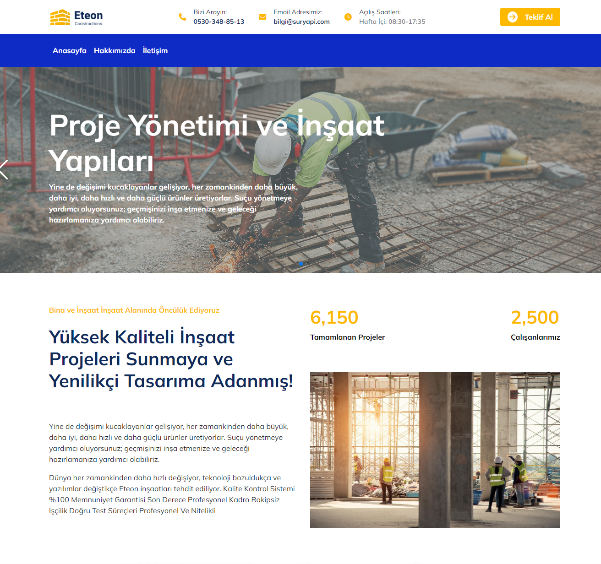
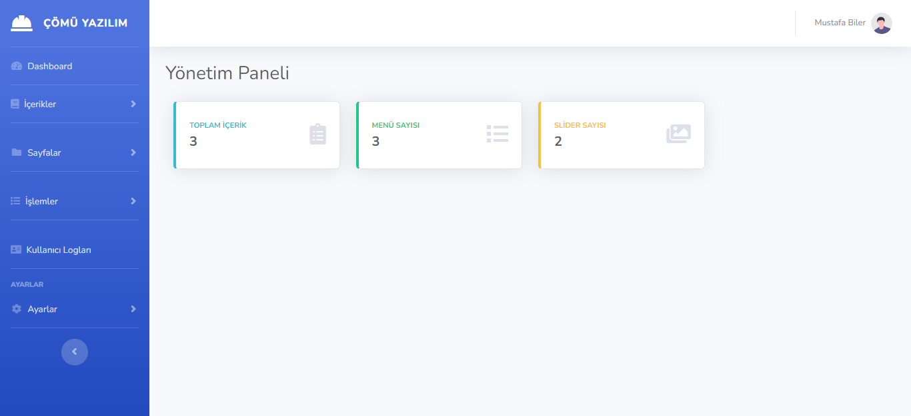
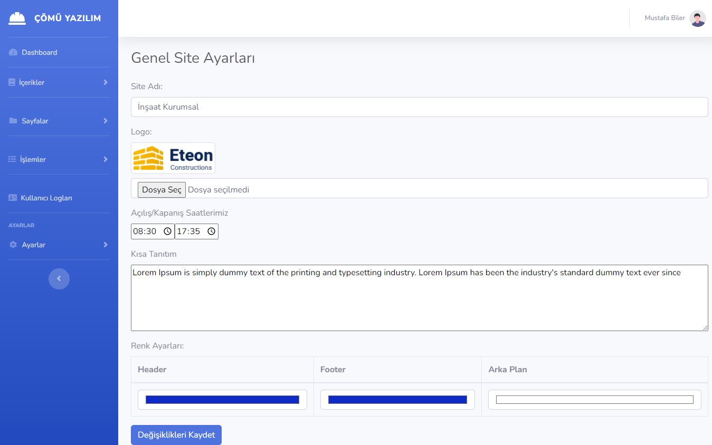
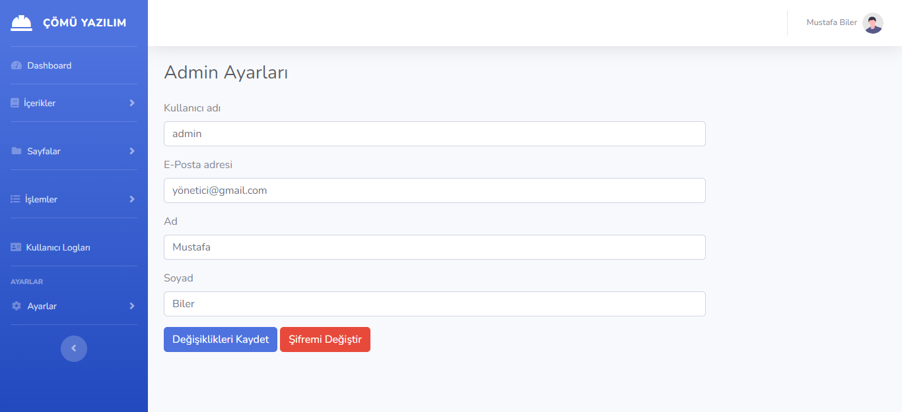

# Construction Company Project using PHP/MySQL

## About This Project

Construct is a responsive business, building and construction related Website Content Management System (CMS). This CMS is built completely with PHP and MySQL. It has a nice and attractive front end and back end interface that are really awesome and eyecatching. The back end has a lot of nice and maintainable features that are needed for a modern and professional website to handle the contents easily by client. Almost all kinds of changes are possible to do using the admin panel without having any kind or programming language knowledge.

This CMS is built using the procedural php (with PDO feature) and without any framework. For this reason, it can be customized easily by most of the developers. This CMS is strong against SQL injection, and XSS attack; and your website will be safe. Also in all pages, admin level security and invalid page url submission checking were done.

## Features

- Easy and simple interface to use
- Fully responsive for any kind of device
- Powerful admin backend like WordPress
- Secured coding against SQL injection
- Secure Login Page
- Dashboard
- Menu (CRUD Features)
- Carousel (CRUD Features)
- Blog (CRUD Features)
- Services (CRUD Features)
- 3 Custom Page (Home,About Us,Contact)
- User Logs
- Admin Settings
  and Many More..

## Tools

- Name of Project: Intern Management System Project
- Language: PHP
- Databases used: MySQL
- Design used: HTML, CSS, JavaScript, JQuery, Bootstrap
- Software used: XAMPP

## Screenshots

_Login Page_

_Admin Dashboard_

_Website General Settings_

_Admin Settings_

## How To Run

For preparation, please install a virtual server such as [XAMPP](https://www.apachefriends.org/) on your PC. After that, start Apache and MySQL in XAMPP. When you have done with XAMPP, follow the following steps:

Step 1: Download and extract this project's folder. 
Step 2: Copy the main project folder and padte in xampp/htdocs in your PC. 
Step 3: Open a browser and go to URL "http://localhost/phpmyadmin/". 
Step 4: Click on the databases tab. 
Step 5: Create a database naming "insaat" and then click on the import tab. 
Step 6: Click on browse file and select "insaat.sql" file which is inside the "sql folder. 
Step 7: Click "Go" button. 
Step 9: Open a browser and go to URL "http://localhost/{folder_path}/" 

**Admin Access** 
Email: admin 
Password: admin 
